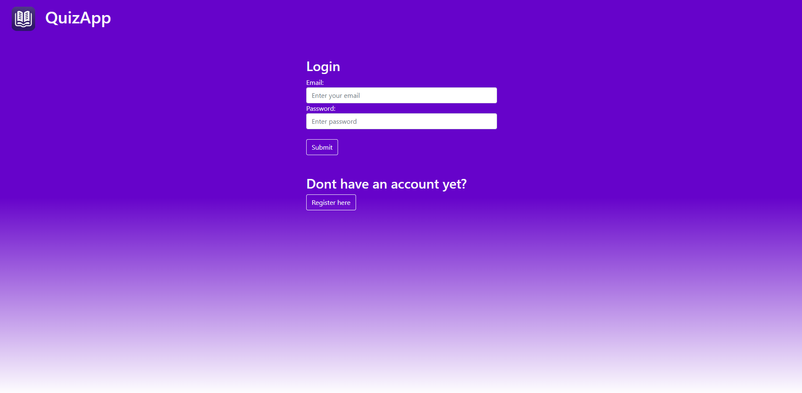
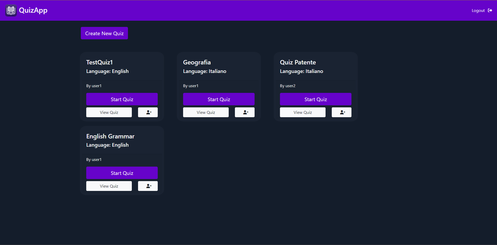
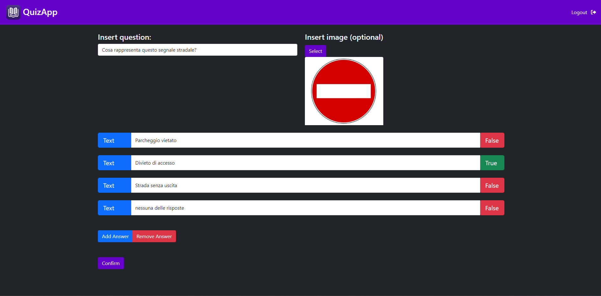
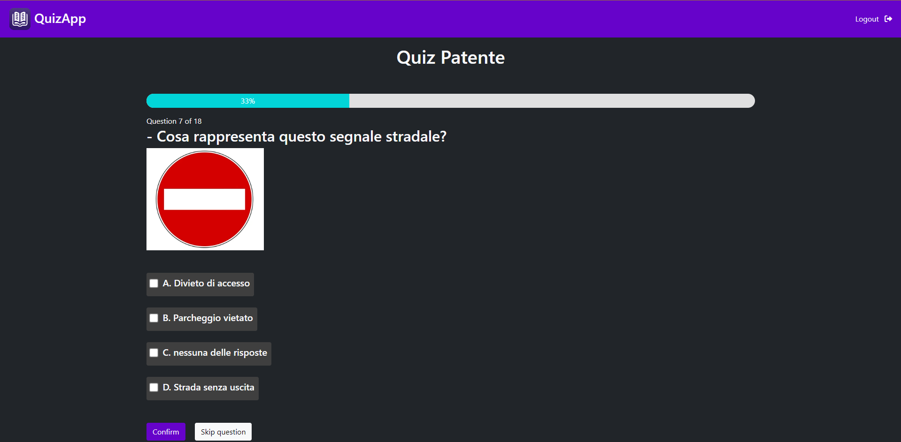

## Introduzione

Questo progetto riguarda lo sviluppo e la gestione di una webapp che permette agli utenti di creare e condividere quiz. L'obiettivo principale è facilitare l'apprendimento attraverso quiz interattivi.

## Tecnologie Utilizzate

- **Linguaggi di programmazione:** PHP, HTML, CSS, JavaScript
- **Framework:** Bootstrap
- **Database:** MariaDB (SQL)
- **Server web:** Apache su un server cloud Ubuntu (Amazon Lightsail)
- **Sicurezza:** SSL/TLS

## Descrizione del Progetto

### Funzionalità Principali

Il sito permette agli utenti di:

- Registrarsi e accedere al proprio account.
- Creare quiz personalizzati con domande che possono includere testo e immagini. Le risposte possono essere di tipo testo o immagine.
- Condividere quiz con altri utenti registrati al sito.
- Partecipare ai quiz e vedere le risposte corrette per ciascuna domanda subito dopo aver risposto.

### Struttura del Sito

Il sito è composto dalle seguenti pagine principali:

- **Pagina di Registrazione/Login:** Accesso utenti.

- **Home Page:** Vista di quiz creati o condivisi.

- **Pagina di inserimento questiti per quiz**.

- **Pagina di risposta a domande di un quiz**.

### Gestione del Server

Il server è gestito in Cloud attraverso Amazon AWS Lightsail. La configurazione del server include l'installazione e l'ottimizzazione di Apache per servire le pagine web e MariaDB per la gestione del database. Per garantire la sicurezza del server, sono state adottate varie misure, tra cui:

**Configurazioni di firewall**: per limitare l'accesso alle porte necessarie e prevenire accessi non autorizzati. Le porte aperte includono:

- Porta 22 (SSH): utilizzata per l’accesso in remoto al server a riga di comando.
- **Porta 80 (HTTP)**: utilizzata per il traffico web non criptato.
- **Porta 443 (HTTPS)**: utilizzata per il traffico web criptato, garantendo che le comunicazioni tra il server e gli utenti siano protette.
- **Porta 3306 (MySQL/MariaDB)**: aperta per la gestione del database da remoto, permettendo accessi amministrativi e gestione del database in modo sicuro. L'accesso a questa porta è limitato a indirizzi IP specifici per prevenire accessi non autorizzati.

**Implementazione di SSL/TLS**: tramite Certbot per criptare le comunicazioni tra il server e gli utenti, proteggendo i dati sensibili come le password degli utenti. Questo è stato configurato per un dominio pubblico registrato, garantendo che il sito web sia accessibile in modo sicuro tramite un URL facilmente ricordabile.

## Conclusione

Il progetto è stato sviluppato in meno di un mese e continuato per altri 2 ed ora non è piu in corso di sviluppo. Il progetto è nato dalla richiesta di una persona interessata a una piattaforma gratuita per creare e condividere quiz. Mi è stato chiesto di sviluppare questo servizio gratuitamente e ho deciso di renderlo open-source. Non mi sono ispirato a progetti esistenti, ma ho cercato di trovare un design e una struttura che ritenevo più adatti alle esigenze del progetto cercando di sfruttare le conoscenze acquisite durante il mio percorso scolastico e quelle sviluppate individualmente.

